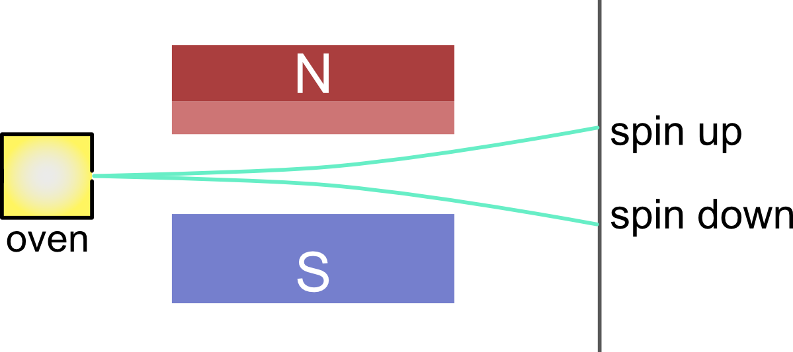

# 第一个Fortran程序
本章会讲解一个简单的小程序，一方面能让你继续熟练使用你的编程环境，另一方面是让你对Fortran有初步的了解。

我们会尽可能详细地讲解每一行代码的含义，但是请放心，如果你对理解特定语句暂时感到困难，请直接跳过。通过后续章节循序渐进地学习，你最终还是可以学会相关语法。

## 讲解前的准备
在命令行中执行`fpm new first-fortran`创建新项目。在fpm项目的`src`目录中新建名为`Stern_Gerlach_experiment.f90`的文件（别忘了删除默认生成的.f90文件），并将以下内容写到该文件中：
```fortran
module Stern_Gerlach_experiment
    implicit none
    private
    public :: emit_atom

contains

    subroutine emit_atom()
        real :: raw_number
        integer :: spin ! 0代表spin up，1代表spin down

        call random_number(raw_number) ! raw_number的范围是[0,1)
        spin = nint(raw_number) ! 四舍五入得到0或1

        if (spin == 0) then ! 判断spin的值，若等于0，则执行下面语句
            write (*, *) "Emit an atom with spin up."
        else ! 否则执行这一部分
            write (*, *) "Emit an atom with spin down."
        end if

    end subroutine

end module
```
接下来修改`app`中的`main.f90`，将其中的内容改为：
```fortran
program main
    use Stern_Gerlach_experiment ! 引入模块，从而能够使用其中定义的变量及过程
    implicit none
    integer, parameter :: emission_times = 5 ! 实验的观察次数
    integer :: i

    do i = 1, emission_times
        call emit_atom()
    end do

end program
```
完成以上步骤后，在命令行中执行`fpm run`。如果项目能够成功编译并执行，你会在命令行中看到类似于这样的执行结果
```
 Emit an atom with spin down.
 Emit an atom with spin up.
 Emit an atom with spin up.
 Emit an atom with spin down.
 Emit an atom with spin up.
```
在详细解释代码之前，我们先简要介绍这段代码所描述的物理过程。这个小程序模拟的是[施特恩－格拉赫实验](https://zh.wikipedia.org/wiki/施特恩－格拉赫实验)。

电子具有自旋角动量，可以产生自旋磁矩。由于其自旋角动量的取值是量子化的，且仅有两种取值（我们将其分别标记为spin up和spin down），因而磁矩也仅有两种取向。因此，如果将含有未成对电子的原子束打向非均匀的磁场，其中的原子因磁矩的不同，会偏转产生不同方向的两束原子，在照相板上产生两条分立的沉积痕迹。这个实验使人们第一次观察到电子自旋磁矩的量子化。

我们的第一个程序将依次「发射一个原子」，这个原子的自旋角动量是随机的，然后程序将观察结果打印到屏幕中。

## 模块部分

首先来看`Stern_Gerlach_experiment.f90`。这个文件中的`module Stern_Gerlach_experiment`和`end module`，以及它们包含的内容，构成了一个Fortran模块（module）。模块就像一个工具箱，把关于同一个任务的变量、函数、子程序等都打包在一起，提供给使用这个模块的程序其他部分。`Stern_Gerlach_experiment`是模块的名字，表明这个模块会提供模拟施特恩－格拉赫实验的功能。

`implicit none`告诉编译器，在这个模块中的所有变量，都必须显式（explicit）地声明后才能使用。我们建议你在编写程序时，始终使用这个语句，可以有效地避免出现计算结果的错误。

接下来的`private`语句，会隐藏模块中的定义的所有变量和函数等内容。明明模块是为了提供给他人使用的，为什么还要隐藏其中的内容呢？有两点原因：
1. 首先模块中并非所有内容都是应当对外公开的，就像一台仪器，需要用外壳将其机身封装起来，使用者只会操作其外部的按钮。模块中也有一部分是仅供模块内部使用的，将其暴露在外，使用者可能会将其修改，导致错误的结果；
2. 其次，一个设计良好的模块，在完成其功能的前提下，应尽可能减少对外提供的内容。这样可以减小使用者的记忆量，更加友好。

然后利用`public :: emit_atom`语句说明`emit_atom`这个功能是公开的，使用了这个模块的代码就可以调用`emit_atom`。

在这个模块中，我们只定义了一个子程序（subroutine）`emit_atom`。子程序和函数（function）都定义在模块的`contains`语句之后。与模块的定义非常相似，子程序定义在`subroutine emit_atom()`和`end subroutine`之中。`subroutine emit_atom()`中的括号用于放置虚参列表，不过该子程序并没有虚参，所以这里为空。
```fortran
real :: raw_number
integer :: spin ! 0代表spin up，1代表spin down
```
这两行分别定义了一个`real`类型的变量`raw_number`和`integer`类型的变量`spin`，在该子程序后续内容中，我们可以使用`raw_number`和`spin`来储存数值，并用于计算、判断等操作。`real`类型的变量类似于数学中的实数，可储存包含小数部分的数值，也被称为「浮点数」；`integer`类型的变量则类似数学中的整数，不包含小数部分。我们定义的`spin`将可能取值`0`或`1`，分别表示spin up状态和spin down状态。

在Fortran中，`!`用于标记对代码的注释。从`!`开始一直到行尾的内容都是注释。注释对程序执行不起任何作用，它只是注解代码的功能，方便阅读者理解代码，提高代码的可维护性。我们鼓励读者适当地在代码中添加注释，无论是对于自己还是其他阅读代码的人，都是有好处的。

接下来则是子程序的具体执行部分。
```fortran
call random_number(raw_number) ! raw_number的范围是[0,1)
spin = nint(raw_number) ! 四舍五入得到0或1
```
我们首先调用了Fortran内置的子程序`random_number`，`raw_number`作为参数接收`random_number`执行产生的结果。`random_number`会随机产生均匀落在\\([0,1)\\)区间的浮点数，因此`raw_number`的数值就在这个范围里。之后我们调用内置的函数`nint`根据`raw_number`的值四舍五入得到整数`0`或者`1`，并将该结果赋值给`spin`。这里的`=`表示赋值操作，将右边变量的值复制给左边的变量。

对比这两行语句，可以看出子程序与函数调用方式的不同。虽然子程序和函数并没有本质上的不同，但是函数相比子程序多了一个「返回值」。在这个例子中，`random_number`子程序内部产生随机的值，然后赋值给`raw_number`，然后我们就可以使用这个值；而`nint`函数则是根据`raw_number`的值进行四舍五入，并不会直接修改`raw_number`，计算得到的整数`0`或`1`是通过返回值的方式赋值给`spin`。当然函数也可以直接修改被传入的参数，我们将在函数与子程序章节讲解。

现在我们随机产生了具有不同自旋状态的原子，我们要观测它们的自旋，并把观测结果输出到屏幕。
```fortran
if (spin == 0) then ! 判断spin的值，若等于0，则执行下面语句
    write (*, *) "Emit an atom with spin up."
else ! 否则执行这一部分
    write (*, *) "Emit an atom with spin down."
end if
```
`spin == 0`表达式会将`spin`的值与`0`进行比较，如果`spin`的值等于`0`，得到`.true.`（`logical`变量真），反之则得到`.false.`（`logical`变量假）。因此，经过比较，如果`spin`的值为`0`，就会执行第一个语句，将`Emit an atom with spin up.`打印到屏幕。

注意，在代码中我们并不是直接写`Emit an atom with spin up.`，而是用双引号`"`将其限定。这样得到的是一个字符串，其中的内容为`Emit an atom with spin up.`。

相应地，如果`spin`的值为`1`，就不会执行第一条语句，而是进入到第二条语句，向屏幕输出`Emit an atom with spin down.`

## 主函数部分

到此为止，我们已经介绍完`Stern_Gerlach_experiment`模块的内容，我们现在来看`main.f90`中的内容。这个源代码文件中定义了`program`，这是我们程序的「主函数」。主函数是一个可执行Fortran程序必不可少的部分，因为它是程序执行的入口。当执行编译得到的程序时，首先会进入到`program`中，开始依次执行其中的语句。`main`是我们为主函数起的名字，你也可以换成其他名字，只要不与程序其他部分的名字冲突。
```fortran
use Stern_Gerlach_experiment ! 引入模块，从而能够使用其中定义的变量及过程
```
我们在主函数开头引入此前定义的模块，这样我们就可以在主函数中使用这个模块提供的功能。

同样地，我们在主函数中也使用`implicit none`语句。注意它与`use`模块语句的顺序，`implicit none`必须在所有`use`语句之后出现。
```fortran
integer, parameter :: emission_times = 5 ! 实验的观察次数
integer :: i
```
然后我们为主函数定义必要的变量。`i`的定义与前面你看到的`spin`类似，但是你会注意到`emission_times`有所不同。对于`emission_times`，除了标记其类型的`integer`以外，还多了一个`parameter`。`parameter`说明了`emission_times`是一个「常量」，或者说「不可变」的变量，在定义之后就不可再修改其值。显然常量在定义时需要同时指定值，我们将`emission_times`的值定义为`5`。
```fortran
do i = 1, emission_times
    call emit_atom()
end do
```
主函数的主体是一个循环结构。所谓循环，就是重复执行一些语句。我们知道`emission_times`的值为`5`，循环开头实际的含义就是`do i = 1, 5`。这会使`i`分别被赋值为`1, 2, 3, 4, 5`，而其中的`call emit_atom()`语句也会相应执行五次。每次执行`emit_atom()`，其内部会随机产生一个原子，并打印对原子的观察结果。这样就完成了五次观察实验。

## 练习
* 尝试更改`emission_times`的值，例如将其改为`10`或者`0`。重新编译并执行，看看结果有何不同。
* 在执行`call random_number(raw_number)`之后打印出`raw_number`的值，对比其四舍五入后是否与`spin`的值一致。
* 在`do`循环中打印`i`的值。
